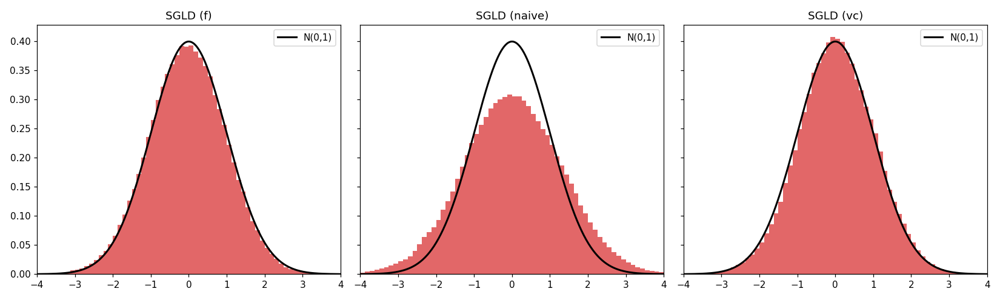

# low-precision-sgld-jax

A [JAX](https://github.com/jax-ml/jax) reimplementation of **Low-Precision SGLD** for
Bayesian deep learning — the PyTorch original rebuilt on
[Equinox](https://github.com/patrick-kidger/equinox) (models), with the
**QPyTorch dependency replaced by a small pure-JAX quantization module**.

This is a reimplementation written with the assistance of
**[Claude Code](https://claude.com/claude-code)** (Anthropic). It ports the method — it
does not introduce it. All credit for the algorithm and the original code goes to the
authors:

> Ruqi Zhang, Andrew Gordon Wilson, Christopher De Sa.
> **Low-Precision Stochastic Gradient Langevin Dynamics.** ICML 2022.
> [paper](https://arxiv.org/pdf/2206.09909.pdf) · [original code](https://github.com/ruqizhang/low-precision-sgld)

```bibtex
@article{zhang2022lpsgld,
  title={Low-Precision Stochastic Gradient Langevin Dynamics},
  author={Zhang, Ruqi and Wilson, Andrew Gordon and De Sa, Christopher},
  journal={International Conference on Machine Learning},
  year={2022}
}
```

This repo contains **only the JAX reimplementation**. For the original PyTorch sources
(reference training scripts, the model zoo, the fully low-precision layers), see the
original repo: **https://github.com/ruqizhang/low-precision-sgld**.

## The QPyTorch replacement

The original depends on [QPyTorch](https://github.com/Tiiiger/QPyTorch) for
low-precision arithmetic simulation (fixed-point / block-floating-point / float with
nearest & stochastic rounding). Rather than port QPyTorch's CUDA kernels or adopt a
heavier JAX quantization library (AQT/Qwix, which target HW-accelerated INT8/FP8 QAT and
don't expose arbitrary fixed-point simulation), the whole dependency collapses to
**`lpsgld_jax/quant.py`** (~150 lines of elementwise JAX). The paper's actual novelty —
variance-corrected (VC) quantization — was always plain tensor math and lives in
`lpsgld_jax/vc.py`.

`quant.py` is validated **bit-for-bit against real QPyTorch** on GPU
(`tests/crosscheck_qtorch.py`): nearest rounding matches exactly (`max|Δ|=0`), stochastic
rounding matches by mean-preservation.

## The idea

Low-precision SGD is common; low-precision *sampling* is not. Naively rounding a noisy
SGLD update distorts the per-step noise variance and biases the stationary distribution.
**Variance-corrected (VC) quantization** produces a quantized sample whose discrete
distribution has exactly the target Langevin variance, so 8-bit SGLD matches
full-precision SGLD. Three variants:

| variant | accumulator | weights/grads |
|---|---|---|
| `sgldlp_f` (SGLDLP-F) | full precision | low precision |
| `naive`   (SGLDLP-L)  | low precision  | low precision (biased) |
| `vc`      (SGLDLP-L)  | low precision  | low precision, variance-corrected |

## Layout

```
lpsgld_jax/
  quant.py       fixed-point / block-FP / float quantize (nearest+stochastic) -- replaces QPyTorch
  vc.py          variance-corrected quantization (the paper's contribution)
  optim_lp.py    low-precision SGLD update (3 variants)
  schedule.py    decay + cyclic (M-cycle cosine) LR
  models/resnet.py, data.py, download.py   Equinox ResNet18 + CIFAR loader (reused from csgmcmc-jax)
  train_cifar.py, ensemble.py, gaussian.py
tests/           quant unit tests, QPyTorch cross-check, gaussian + CIFAR smoke
```

## Install & run

```bash
pip install -e .            # jax, equinox, optax, numpy
pip install -e '.[plot]'    # + matplotlib/scipy for figures

python -m lpsgld_jax.gaussian --plot                       # toy: reproduces figs/gaussian_jax.png
python -m lpsgld_jax.download --dataset cifar10 --root data
python -m lpsgld_jax.train_cifar --data_path data --dir runs/vc --variant vc --lr_type cyclic
python -m lpsgld_jax.ensemble  --data_path data --dir runs/vc
```

## Results

**Gaussian toy** (sampling N(0,1) at 8-bit). Naive low-precision SGLD inflates the
variance (std **1.30**); VC corrects it (std **1.00**) — reproducing the paper's figure:



**CIFAR-10 / ResNet18**, 8-bit, 245 epochs, ensemble of samples (H100):

| variant | what's quantized (8-bit) | BMA accuracy | error % | ECE % |
|---|---|---|---|---|
| SGLDLP-F | weights/grads (fixed); full-precision accumulator | **94.79%** | 5.21 | 1.45 |
| VC SGLDLP-L | weights/grads/accumulator (block-FP) | **94.66%** | 5.34 | **0.58** |
| **VC SGLDLP-L, fully low-precision** | **+ activations & errors — 8-bit everywhere** | **94.55%** | 5.45 | 0.72 |
| VC SGLDLP-L | weights/grads/accumulator (fixed) | 93.32% | 6.68 | 1.44 |
| naive SGLDLP-L | weights/grads/accumulator (fixed) | 92.89% | 7.11 | 2.21 |

**Block-FP VC SGLDLP-L matches full-precision-accumulator SGLD** (94.66 vs 94.79%, a
0.13% gap) with a *low-precision* accumulator — the paper's headline — and has the
**best calibration** (ECE 0.58%). Block floating point gives each channel a grid matched
to its own magnitude (`--number block`), closing the ~1.5% gap that fixed-point VC leaves.

**Fully low-precision** (`--lp_layers`: also quantize activations on the forward pass and
errors on the backward pass) puts the *entire* network in 8 bits and still reaches 94.55%
(ECE 0.72%) — only 0.24% below full precision. Across the board, **VC beats naive** on
accuracy and — the point of the method — calibration (correcting the quantization variance
yields better-calibrated uncertainty).

## Scope

The core method is fully ported: VC quantization (fixed & block-FP), all three SGLD
variants, both schedules, and — via `jax.custom_vjp` — the fully low-precision network
(activation + backward/error quantization, `models/resnet_low.py`). Not yet run: CIFAR-100
(the code path exists, `--dataset cifar100`) and the original's other architectures.
For the original PyTorch sources see the
[original repo](https://github.com/ruqizhang/low-precision-sgld).

## Tests

```bash
JAX_PLATFORMS=cpu PYTHONPATH=. python tests/test_quant.py      # quant primitives
JAX_PLATFORMS=cpu PYTHONPATH=. python tests/test_gaussian.py   # VC corrects naive bias
JAX_PLATFORMS=cpu PYTHONPATH=. python tests/test_vc_block.py   # block-FP adaptive grid + unbiased
JAX_PLATFORMS=cpu PYTHONPATH=. python tests/test_lp_layers.py  # activation/error quant (custom_vjp)
JAX_PLATFORMS=cpu PYTHONPATH=. python tests/test_cifar_smoke.py
PYTHONPATH=. python tests/crosscheck_qtorch.py                 # needs torch+qtorch (GPU)
```
